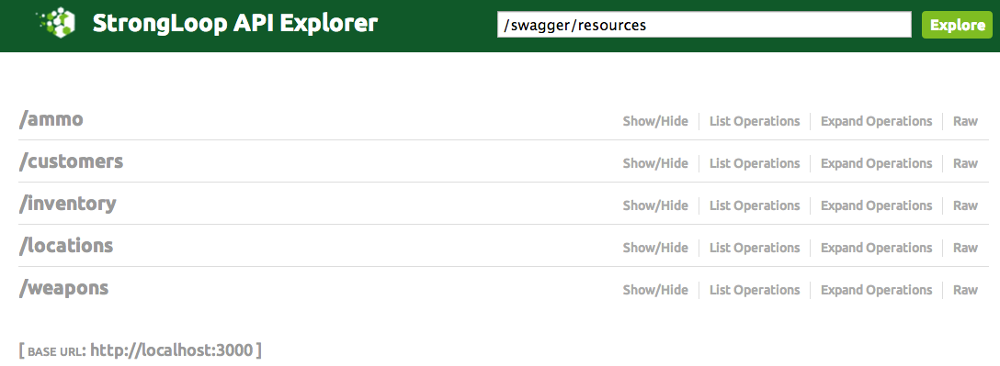
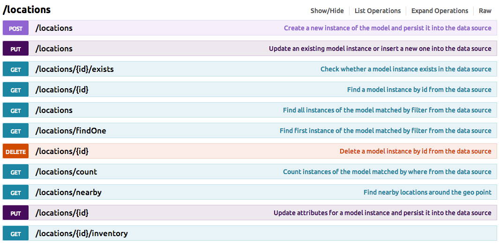
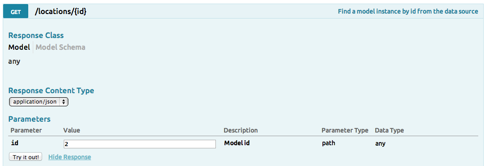
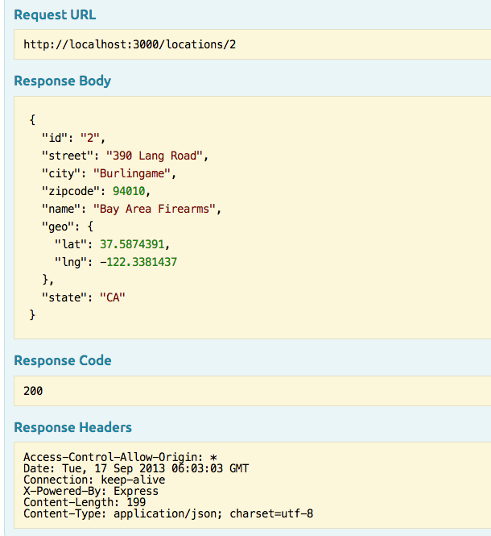

### Using the API Explorer

Follow these steps to explore the sample app's REST API:

1. Open your browser to http://localhost:3000/explorer. You'll see a list of REST API endpoints as illustrated below.

The endpoints are grouped by the model names. Each endpoint consists of a list
of operations for the model.
2. Click on one of the endpoint paths (such as /locations) to see available
operations for a given model.  You'll see the CRUD operations mapped to HTTP verbs and paths.

3. Click on a given operation to see the signature; for example, GET `/locations/{id}`:

Notice that each operation has the HTTP verb, path, description, response model, and a list of request parameters.
4. Invoke an operation: fill in the parameters,  then click the **Try it out!** button.  You'll see something like this:

You can see the request URL, the JSON in the response body, and the HTTP response code and headers.

<h3>Next Steps</h3>

To gain a deeper understanding of LoopBack and how it works, read the following sections, [Working with Models](#working-with-models) and [Working with Data Sources and Connectors](#working-with-data-sources-and-connectors).

For information on how StrongLoop Suite provides:

 - Out-of-the-box scalability, see
 [StrongNode](http://docs.strongloop.com/strongnode#quick-start).
 - CPU profiling and path trace features, see
 [StrongOps](http://docs.strongloop.com/strongops#quick-start).
 - Mobile client APIs, see [LoopBack Client SDKs](http://docs.strongloop.com/loopback-clients/).
