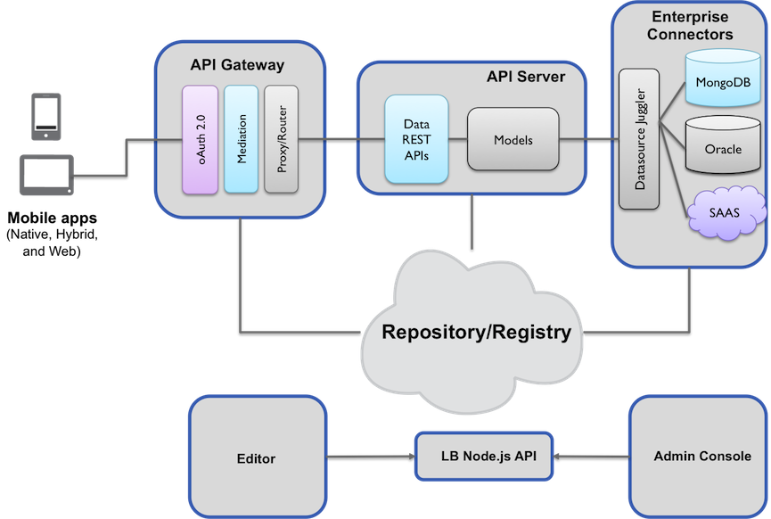

## Key Concepts

This section goes into more depth describing models, data sources, connectors and other important LoopBack concepts.

### Models

A LoopBack Model consists of:

 - Application data.
 - Validation rules.
 - Data access capabilities.
 - Business logic.

Mobile clients use the model API to display information to the user or trigger actions
on the models to interact with backend systems.

Here is a simple example of creating and using a model.

<h4>Defining a Model</h4>

Consider an e-commerce app with `Product` and `Inventory` models.
A mobile client could use the `Product` model API to search through all of the
products in a database. A client could join the `Product` and `Inventory` data to
determine what products are in stock, or the `Product` model could provide a
server-side function (or [remote method](#remote-methods)) that aggregates this
information.

For example, the following code creates product and inventory models:

```js
var Model = require('loopback').Model;
var Product = Model.extend('product');
var Inventory = Model.extend('customer');
```

**NOTE:** By default, a LoopBack model does not have a schema.  This is appropriate when data is "free form." However, some data sources, such as relational databases, require schemas. Additionally, schemas are valuable to enable data exchange and to validate or sanitize data from clients; see [Sanitizing and Validating Models](#sanitizing-and-validating-models).

<h4>Attaching Models to Data Sources</h4>

A data source enables a model to acess and modify data in backend system such as a relational database.
Attaching a model to a data source, enables the model to use the data source API.  For example, as shown below, the [MongoDB Connector](http://docs.strongloop.com/loopback-connector-mongodb), mixes in a `create` method that you can use to store a new product in the database; for example:

```js
// Attach data sources
var db = loopback.createDataSource({
  connector: require('loopback-connector-mongodb')
});

// Enable the model to use the MongoDB API
Product.attachTo(db);

// Create a new product in the database
Product.create({ name: 'widget', price: 99.99 }, function(err, widget) {
  console.log(widget.id); // The product's id, added by MongoDB
});
```

Now the models have both data and behaviors. Next, you need to make the models available to mobile clients.

<h4>Exposing Models to Mobile Clients</h4>

To expose a model to mobile clients, use one of LoopBack's remoting middleware modules.
This example uses the `app.rest` middleware to expose the `Product` Model's API over REST.

```js
// Step 3: Create a LoopBack application
var app = loopback();

// Use the REST remoting middleware
app.use(loopback.rest());

// Expose the `Product` model
app.model(Product);
```

After this, you'll have the `Product` model with create, read, update, and delete (CRUD) functions working remotely
from mobile clients. At this point, the model is schema-less and the data are not checked.

<h4>Sanitizing and Validating Models</h4>

A *schema* provides a description of a model in JSON or JavaScript.  Once a schema is defined for a model, the model validates and sanitizes data before giving it to a data source. LoopBack schemas are written in **LoopBack Definition Language**, a specific form of JSON.

For example, the following code defines a schema and assigns it to the product model.  The schema defines two fields (columns): **name**, a string, and **price**, a number.  The field **name** is a required value.

```js
var productSchema = {
  "name": { "type": "string", "required": true },
  "price": "number"
};
var Product = Model.extend('product', productSchema);
```

A schema imposes restrictions on the model: If a remote client tries to save a product with extra properties
(for example, `description`), those properties are removed before the app saves the data in the model.
Also, since `name` is a required value, the model will _only_ be saved if the product contains a value for the `name` property.

<h4>More Information</h4>

- Check out the Model [REST API](#rest-api).
- Read the
[LoopBack Definition Language Guide](http://docs.strongloop.com/loopback-datasource-juggler#loopback-definition-language-guide).
- Browse the [Node.js model API](#model).
- Before you build your own, check out the [bundled models](#bundled-models).
- Expose custom behavior to clients using [remote methods](#remote-methods).
- See how to [define relationships](#relationships) between models.

### Data Sources and Connectors

Data sources and connectors provide a rich set of functions to models out of the box.

Data sources encapsulate business logic to
exchange data between models and various data sources. Data sources are
typically databases that provide create, retrieve, update, and delete (CRUD)
functions. LoopBack also generalize other backend services, such as REST APIs,
SOAP Web Services, and Storage Services, as data sources.

LoopBack allows you to connect to many sources of data and services both in the
cloud and on-premise in your data center. DataSources are accessed through a
plugin called a Connector in LoopBack.  Plugins are highly customizable and
extensible.  Unlike other mobile backends, LoopBack can leverage your existing
data and organize them in the form of models.

Connectors implement the data exchange logic using database drivers or other
client APIs. In general, connectors are not used directly by application code.
The DataSource class provides APIs to configure the underlying connector and
exposes functions via DataSource or model classes.

#### LoopBack Connector Modules

|    Type   | Package Name                                                                           |
| --------- | -------------------------------------------------------------------------------------- |
| Memory    | [Built-in](https://github.com/strongloop/loopback-datasource-juggler)                  |
| MongoDB   | [loopback-connector-mongodb](https://github.com/strongloop/loopback-connector-mongodb) |
| Oracle    | [loopback-connector-oracle](https://github.com/strongloop/loopback-connector-oracle)   |
| REST      | [loopback-connector-rest](https://github.com/strongloop/loopback-connector-rest)       |

For more information, please read the [LoopBack DataSource and Connector Guide](/loopback-datasource-juggler/#loopback-datasource-and-connector-guide).

### Mobile Clients

LoopBack provides native Client SDKs to give mobile developers access to remote,
persistent data in a contextually-relevant way. The transport and marshalling of
the data is taken care of, and mobile developers can leverage all of their
existing tools (XCode, Eclipse, et al) to model their data on the client,
persisting it to the server as needed.

To achieve this, LoopBack supports both "Dynamic", schema-less Models and
"Static", schema-driven Models. (See ["Models"](#models) for more specifics and
how-tos around Model creation.)

Dynamic Models require minimal server code up front (just a name!) to set-up,
with the format of the data specified _completely_ and _flexibly_ by the client
application. Well-suited for data that _originates on the client_, mobile
developers can leverage Dynamic Models to persist data both between sessions and
between _devices_ while obviating the need for outside engineering support.
(Let's be honest - how many server programmers do you know that are _excited_
when you ask them to add a field to some schema on the server? None? That's what
we thought.)

Static Models require more code up front in an extended grammar of JSON we call
LDL, with the format of the data specified _completely_ in a _structured_ way by
the server application. Well-suited to both existing data and large, intricate
datasets, mobile developers can leverage Static Models to provide structure and
consistency to their data, preventing the multitude of bugs that can result from
unexpected data in their database. (These pesky bugs _love_ to show up in
production and ruin everyone's launch day. Stop them before they start!)

Use one strategy, or use both. Leverage them to fit your _use case_, rather than
fitting your use case to some fixed modelling strategy. The choice is yours.

### REST

Functions defined in LoopBack Models can be made available as a REST
endpoint. You can see and experiment with _your_ REST api using the
[LoopBack API Explorer](http://localhost:3000/explorer/).

LoopBack also supports other protocols for your API as well. Socket.io is
another protocol that is currently being developed.

For more information, please read [Model REST APIs](#model-rest-api).

### Remoting

With LoopBack you can add whatever functionality you like either
by yourself or leveraging functionality from other open source
modules from the community.  The ability to "mix in" behaviors are
available through the inherent power of Javascript's less resrictive
inheritance model.

LoopBack takes this one step further by allowing you to seamlessly
invoke server side code running in LoopBack in the backend from the
your client on the front end.

For more information, please read the [Remoting Guide](/strong-remoting).

### The Big Picture

LoopBack's overall representation is illustrated below through its
runtime sub-components:

-  Mobile Clients
- API Gateway - ***Coming Soon***
- API Server
- Enterprise Connectors

As well as its management sub-components:

- Editor - ***Coming Soon***
- Admin Console - ***Coming Soon***
- LoopBack Node.js API
- Repository/Registry



At first glance, LoopBack looks like just any other API tier.  But
looks can be deceiving.  Here are some key differentiators that make
Loopback stand out as an api tier built for mobile:

1. Model APIS are surfaced over REST without writing code
2. The Datasource Juggler is a modern ORM that supports
not only traditional RDBMS, but also noSQL and services
3. As a mobile backend as a service (mBaaS) we help you leverage
valuable existing data in your mobile app as well dynamically create
new schema or schema-less data

<h4> Mobile clients </h4>
We're putting a lot of effort into building flexibility and
functionality into our mobile client SDKs.  The ultimate goal is to
preserve what's familiar to the mobile developer in their native
platform and empower them with seamelss backend functionality.

Mobile clients call into LoopBack APIs surfaced by [strong-remoting](http://docs.strongloop.com/strong-remoting), a pluggable transport
layer that supports surfacing backend APIs over REST, WebSockets,
and other transports.

<h4> API Gateway </h4>
The first line of defense and entry is the API gateway.  This
sub-component of LoopBack acts as a reverse-proxy to the rest of
LoopBack.  It provides OAuth2 based security, will mediate between
multiple data formats and acts as a quality of service layer for your
API providing instrumentation and other aspect level functionality.

<h4>  API Server </h4>
The core of LoopBack is the API Server where models are registered
and hosted during runtime.   Models are automatically exposed through a REST endpoint.

The API server also will run batch processes or scheduled jobs as a
mobile backend for functions like mass push notifications.

<h4> Enterprise Connectors </h4>
LoopBack lets you leveratge existing data and services that you need
in your mobile apps just as you do in your web apps.  LoopBack has a
layer of abstraction provided by the DataSource Juggler so that all
you need to worry about is your model.  The Datasource Juggler
accesses the underlying [datasources](http://docs.strongloop.com/loopback/#data-sources-and-connectors) through Enterprise
Connectors.

<h4> Editor </h4>
LoopBack comes with a rich set of [Node.js based APIs](http://docs.strongloop.com/loopback/#nodejs-api).
The editor is a web based GUI that makes it even easier to define,
configure and manage your mobile apps and models without having to
write code.  The editor will also facilitate the process of
[discovering models](http://docs.strongloop.com/loopback/#datasourcediscovermodeldefinitionsusername-fn) and [schemas](http://docs.strongloop.com/loopback/#datasourcediscoverschemaowner-name-fn)
from datasources to give you a headstart on building your app.

<h4> Admin Console </h4>
Each LoopBack development environment is fully self contained.  When
working in the enterprise, there is a need to distribute work much
like how distributed source control systems like `git` have risen and
evolved.  When combining the work output from multiple LoopBack
development environments into a single enterprise runtime, the Admin
Console helps with merging and maintaining configuration as well as
deployment.


<h4> Repository </h4>
All development in LoopBack ends up as metadata that's stored in JSON
config files.  Config files are distributed, merged and
consolidated centrally into the Repository.  The Repository is
centrally maintained by an admin through the [Admin
Console](http://docs.strongloop.com/loopback#admin-console) where
policies like security are defined and configured.


<h4> LoopBack Node.js API </h4>
All manipulation of the metadata that constitutes the entire runtime
of the mobile API is done through an internal Node.js API.  In the
spirit of truly "eating our own dog food" - the API powers the
editor and any other tools that are included with LoopBack.


---
