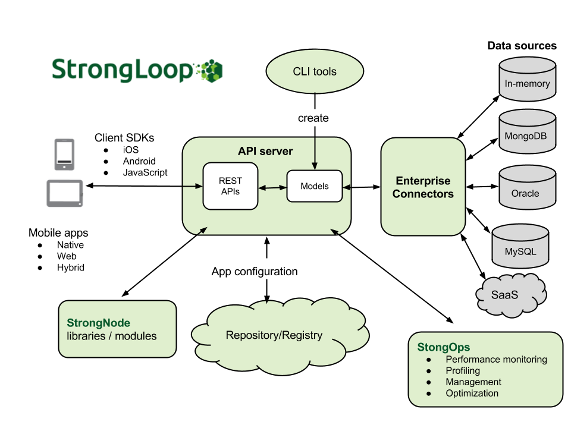

<h1> LoopBack</h1>

LoopBack is a mobile backend framework that you can run in the cloud or on-premises.
It is built on [StrongNode](http://strongloop.com/strongloop-suite/strongnode/) and open-source Node.js modules. For more information on the advantages of using LoopBack, see [StrongLoop | LoopBack](http://strongloop.com/strongloop-suite/loopback/).

To gain a basic understanding of key LoopBack concepts, read the following [Overview](#overview) section.  Then, dive right into creating an app in [Quick Start](#quick-start).

## Overview

LoopBack consists of:

* A library of Node.js modules for connecting mobile apps to data sources such as databases and REST APIs.
* A command line tool, `slc lb`, for creating and working with LoopBack applications.
* Client SDKs for native and web-based mobile clients.

As illustrated in the diagram below, a LoopBack application has three components:

+ **Models** that represent business data and behavior.
+ **Data sources and connectors**.  Data sources are databases or other backend services such as REST APIs, SOAP web services, or storage services.   Connectors provide apps access to enterprise data sources such as Oracle, MySQL, and MongoDB.
+ **Mobile clients** using the LoopBack client SDKs.

</img>

An app interacts with data sources through the LoopBack model API, available
[locally within Node.js](#model), [remotely over REST](#rest-api), and via native client
APIs for [iOS, Android, and HTML5](#mobile-clients).  Using the API, apps can query databases, store data, upload files, send emails, create push notifications, register users, and perform other actions provided by data sources.

Mobile clients can call LoopBack server APIs directly using [Strong Remoting](/strong-remoting), a pluggable transport
layer that enables you to provide backend APIs over REST, WebSockets, and other transports.

