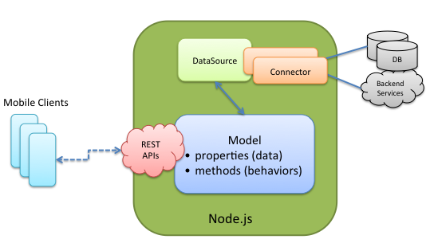

<h1> LoopBack</h1>

LoopBack is a mobile backend framework that you can run in the cloud or on-premises.
It is built on [StrongNode](http://strongloop.com/strongloop-suite/strongnode/) and open-source Node.js modules. For more information on the advantages of using LoopBack, see [StrongLoop | LoopBack](http://strongloop.com/strongloop-suite/loopback/).

To gain a basic understanding of key LoopBack concepts, read the following [Overview](#overview) section.  Then, dive right into creating an app in [Quick Start](#quick-start).

## Overview

LoopBack consists of:

* A library of Node.js modules for connecting mobile apps to data sources such as databases and REST APIs.
* A command line tool, `slc lb`, for creating and working with LoopBack applications.
* Client SDKs for native and web-based mobile clients.

The diagram below illustrates LoopBack's architecture:

LoopBack has the following runtime components:

- Mobile client SDKs
- API gateway (coming soon)
- API server
- Enterprise connectors

LoopBack has the following management components:

- Editor (coming soon)
- Admin console (coming soon)
- LoopBack Node.js API
- Repository/Registry

<h4> Client SDKs </h4>

LoopBack native client SDKs provide access to remote persistent data and handle transport and marshalling of data to the app backend.
You can leverage existing tools (XCode, Eclipse, et al) to model data on the client, persisting it to the server as needed.
Mobile clients call into LoopBack APIs using [strong-remoting](/strong-remoting), a pluggable transport
layer that enables you to provide backend APIs over REST, WebSockets, and other transports.

<h4> API Gateway </h4>

This component has not yet been released.  Coming soon!

The  API gateway acts as a reverse-proxy to the rest of LoopBack.  It provides OAuth 2.0 security, mediates between
multiple data formats, and acts as a quality-of-service layer for application APIs, providing instrumentation and other aspect-level functionality.  <!-- what does "aspect level" mean -->

<h4>  API Server </h4>
The API server registers and hosts models at runtime and automatically exposes them through a REST endpoint.
The API server also runs batch processes or scheduled jobs for functions such as mass push notifications.

<h4> Enterprise Connectors </h4>
LoopBack enables you to leverage existing data and services 
in your mobile apps just as you do in your web apps.  The Datasource Juggler
accesses [datasources](http://docs.strongloop.com/loopback/#data-sources-and-connectors) through enterprise connectors, so all you need to create is your app's model.

<h4> Editor </h4>

This component has not yet been released.  Coming soon!

LoopBack provides a rich set of [Node.js based APIs](http://docs.strongloop.com/loopback/#nodejs-api).
The editor is a web-based GUI that makes it even easier to define,
configure and manage mobile apps and models without having to
write code.  The editor facilitates the process of
[discovering models](http://docs.strongloop.com/loopback/#datasourcediscovermodeldefinitionsusername-fn) and [schemas](http://docs.strongloop.com/loopback/#datasourcediscoverschemaowner-name-fn)
from datasources to give you a head start building your app.

<h4> Admin Console </h4>

This component has not yet been released.  Coming soon!

The LoopBack Admin Console facilitates team app development. 
It enables you to combine work from multiple LoopBack
development environments into a single enterprise runtime and 
helps maintain consistent project configuration. It also provides deployment features.

<h4> Repository </h4>
LoopBack project metadata is stored in JSON configuration files that are distributed, merged, and
consolidated into the repository.  
A project administrator defines policies like security and maintains the repository using the admin
console.

<h4> LoopBack Node.js API </h4>
All manipulation of the metadata that constitutes the entire runtime
of the mobile API is done through an internal Node.js API.  

### Anatomy of a LoopBack application

As illustrated in the diagram below, a LoopBack application has three components:

+ **Models** that represent business data and behavior.
+ **Data sources and connectors**.  Data sources are databases or other backend services such as REST APIs, SOAP web services, or storage services.   Connectors provide apps access to data sources. 
+ **Mobile clients** using the LoopBack client SDKs.

An app interacts with data sources through the LoopBack model API, available
[locally within Node.js](#model), [remotely over REST](#rest-api), and via native client
APIs for [iOS, Android, and HTML5](#mobile-clients).  Using the API, apps can query databases, store data, upload files, send emails, create push notifications, register users, and perform other actions provided by data sources.

<h3>REST API</h3>

You can easily make functions defined in LoopBack models available as REST endpoints. 
For an example, see [Working with Models](#working-with-models).

<h3> Remoting</h3>

With LoopBack you can add functionality to models directly yourself or by leveraging open source
community modules.  The ability to "mix in" behaviors is possible through the inherent power of Javascript's inheritance model.

LoopBack takes this one step further by enabling you to invoke server side code from the client.
For more information, see the [Remoting Guide](/strong-remoting).
